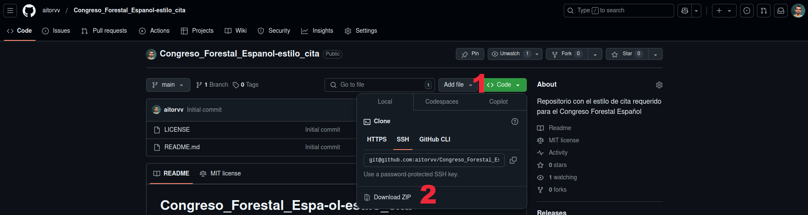
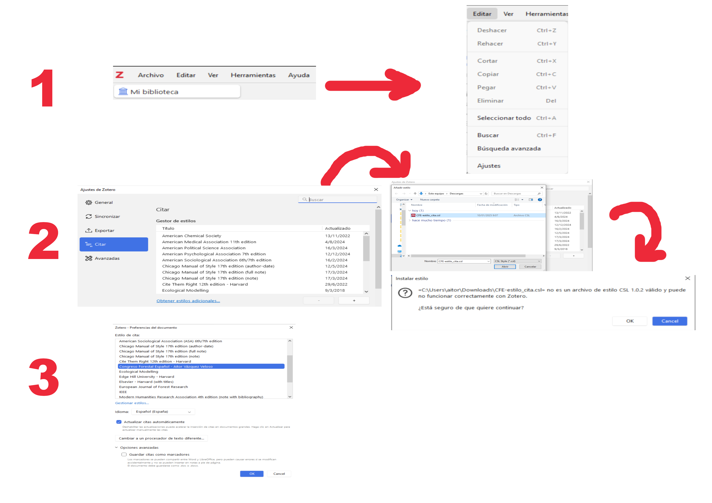
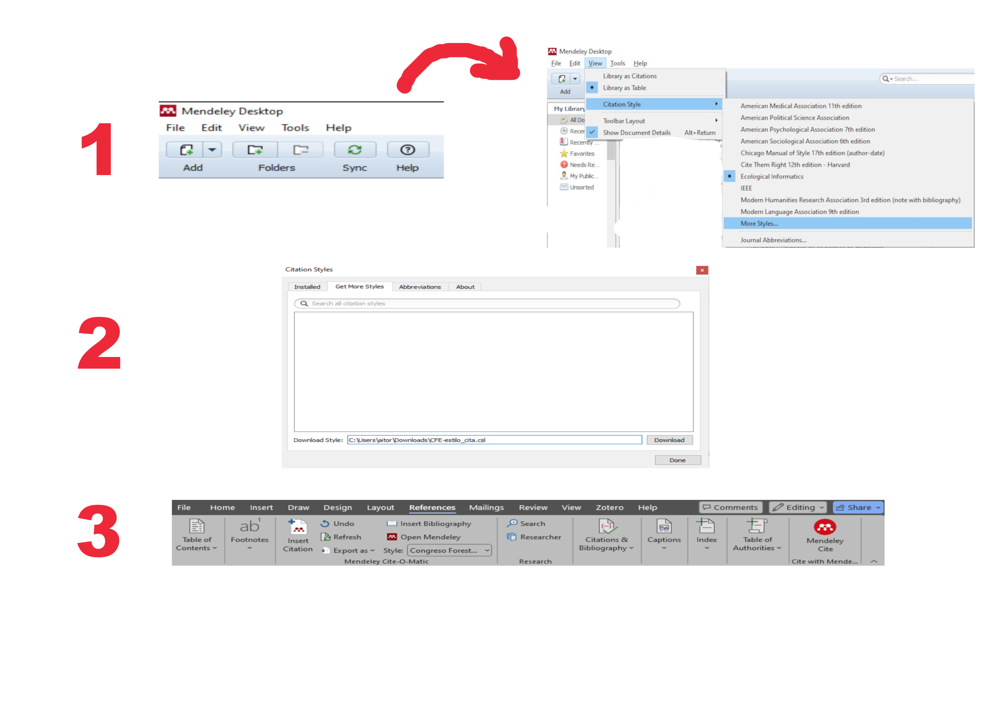

# Congreso Forestal Español - estilo de cita para gestores bibliográficos

*Repositorio con el estilo de cita requerido por los softwares de gestión bibliográfica para los manuscritos del Congreso Forestal Español*

---

## :floppy_disk: :mag: Sobre el archivo de estilo

- Ajustado para distintos tipos de documentos: artículos, comunicaciones a congresos, libros...
- Convierte a mayúsculas apellidos e iniciales de autores automáticamente
- Compatible con los principales gestores de referencias, como Zotero y Mendeley
- Sujeto a mejoras (ver apartado de contacto)
- Ajustado a los requerimientos del Congreso Forestal Español

---

## :sparkles: Ejemplo visual

:warning: *Nótese que las referencias mostradas corresponden a artículos, congresos, libros y capítulos de libros, aplicando el mismo estilo a todas ellas.*

### :scroll: Cita en texto:

> Texto de ejemplo (BRAVO et al., 2025; R CORE TEAM, 2021; VÁZQUEZ-VELOSO et al., 2025a, 2025b; VÁZQUEZ-VELOSO & GÓMEZ-SANZ, 2022)

### :books: Bibliography example:

> BRAVO, F.; ORDÓÑEZ, C.; VÁZQUEZ-VELOSO, A.; MICHALAKOPOULOS, S.; 2025. SIMANFOR cloud Decision Support System: Structure, content, and applications. Ecological Modelling, 499, 110912. https://doi.org/10.1016/j.ecolmodel.2024.110912

> R CORE TEAM.; 2021. R: A Language and Environment for Statistical Computing. R Foundation for Statistical Computing. https://www.R-project.org/

> VÁZQUEZ-VELOSO, A.; GÓMEZ-SANZ, V.; 2022. Identificación de las áreas y formaciones forestales para los que se prevén mayores riesgos de impacto por cambio climático: Evolución proyectada de las condiciones de marginalidad termopluviométrica sobre la distribución actual de las principales especie. In Bravo, F. (coord) 2022. Adaptación al cambio climático: directrices para la adaptación de la gestión del patrimonio natural y la política forestal al cambio climático en Castilla y León. Ed. Universidad de Valladolid, 507 pp. https://iufor.uva.es/wp-content/uploads/2023/05/PROYECTO-ADAPTA-CLIMA-PDF-DEFINITVO-DISFUSION-1.pdf

> VÁZQUEZ-VELOSO, A.; RUANO, I.; ORDÓÑEZ, C.; MICHALAKOPOULOS, S.; BRAVO, F.; 2025a. Modeling and simulation: supporting complex forest management [oral communication]. XIXh Young Researchers Meeting on Conservation and Sustainable Use of Forest Systems.

> VÁZQUEZ-VELOSO, A.; YANG, S. I.; BULLOCK, B. P.; BRAVO, F.; 2025b. Nuevas ecuaciones generalizadas de altura-diámetro para las especies forestales españolas [oral communication]. 9o Congreso Forestal Español. Gijón, España.

---

## :arrow_down: Descarga de archivo .csl

Descarga [aquí](https://github.com/aitorvv/Congreso_Forestal_Espanol-estilo_cita/archive/refs/heads/main.zip) el archivo `.csl` para instalarlo en tu gestor bibliográfico o siguiendo estas instrucciones:

---

## :gear: Guía de instalación

###     Zotero

1. Abre Zotero, ve a ***Editar > Ajustes***
2. Haz clic en el apartado ***Citar*** y a continuación en el botón ***+*** debajo de los estilos de cita ya instalador para añadir un nuevo estilo. Selecciona el archivo `.csl` que has descargado y haz clic en ***Aceptar***; en la siguiente ventana haz clic en ***OK***
3. Revisa si se ha instalado correctamente y... a seguir trabajando! 💪

###   Mendeley

1. Abre Mendeley, ve a ***View > Citation Style > More Styles***
2. Haz clic en la segunda pestaña llamada ***Get More Styles***. A continuación, copia la ruta del archivo `.csl` en el campo vacío que aparece tras ***Download Style*** para cargarlo en Mendeley y selecciona ***Download*** para que se instale correctamente
3. Revisa si se ha instalado correctamente y... a seguir trabajando! 💪

---

##  🌳🌲 Sobre el Congreso Forestal Español
 
- [9º Congreso Forestal Español](https://9cfe.congresoforestal.es/)
- [8º Congreso Forestal Español](https://8cfe.congresoforestal.es/)
- [7º Congreso Forestal Español](https://7cfe.congresoforestal.es/)
- [Actas del 8º Congreso Forestal Español](https://8cfe.congresoforestal.es/es/actas)
- [Archivo de Actas de Congresos Forestales Españoles anteriores](https://secforestales.org/publicaciones/index.php/congresos_forestales/issue/archive)
---

## :email: Contacto

Si tienes alguna sugerencia de mejora no dudes en contactarme:

---

## :scroll: Licencia de uso

El contenido de este repositorio está sujeto a la licencia [MIT License](./LICENSE).

---

